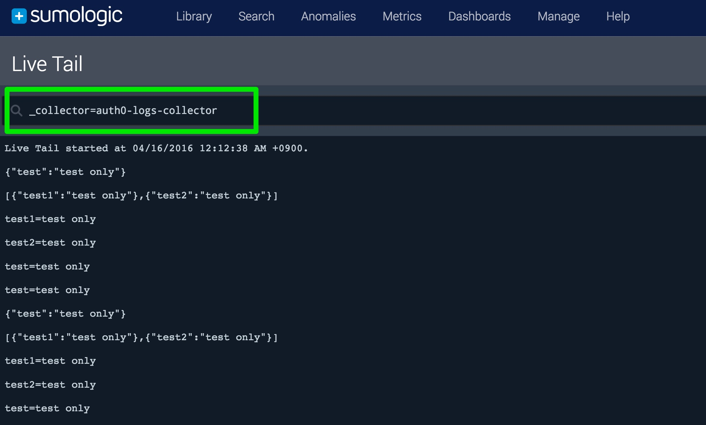

# logs-to-sumologic

A client implementation for Sumologic in node.js.

## Usage

Very simple.

First of all, set up an account with [Sumologic](https://service.us2.sumologic.com)

Create an HTTP Collector endpoint

eg.


```js

const Sumologic = require('logs-to-sumologic');

var collectorCode = 'YOUR_COLLECTOR CODE'

var endpoint = 'YOUR_ENDPOINT'
// 'https://endpoint1.collection.us2.sumologic.com/receiver/v1/http/'

var opts = {
  endpoint: endpoint
};

var url = endpoint + collectorCode;

const sumologic = Sumologic.createClient({
  url: url
});

var cb = function (err, res) {
  if (err) {
    // handle error
  }
  // handle success
};


// contrived examples:

// single log message
var log = {test: "test only"};
sumologic.log(JSON.stringify(log), cb);
// or
sumologic.log(log, cb);

// bulk
var logs = [{test1: "test only"}, {test2: "test only"}];
sumologic.log(JSON.stringify(logs), cb);
// or
sumologic.log(logs, cb);

```

Setup a live tail to your HTTP Collector endpoint

You should see your logs appearing, eg.

